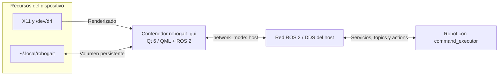

# Despliegue con Docker

<!-- TABLA DE CONTENIDOS -->
<details open>
    <summary><h2>Tabla de contenidos</h2></summary>
    <ol>
        <li><a href="#descripción">Descripción</a></li>
        <li><a href="#organización-de-los-archivos">Organización de los archivos</a></li>
        <li><a href="#arquitectura-del-despliegue">Arquitectura del despliegue</a></li>
        <li><a href="#imagen">Imagen</a></li>
        <li><a href="#configuración">Configuración</a></li>
        <li><a href="#construcción">Construcción</a></li>
        <li><a href="#ejecución">Ejecución</a></li>
        <li><a href="#persistencia">Persistencia</a></li>
        <li><a href="#resolución-de-problemas">Resolución de problemas</a></li>
    </ol>
</details>

<!-- DESCRIPCIÓN -->
## Descripción

Este directorio contiene los recursos necesarios para construir y ejecutar `robogait_gui` dentro de un contenedor Docker. El despliegue proporciona Qt 6, ROS 2 y las dependencias de ejecución de la GUI sin instalarlas directamente en el dispositivo de aplicación.

La imagen contiene los paquetes `command_executor_msgs`, `navigation_pkg` y `robogait_gui`. El nodo `command_executor` no forma parte del contenedor de la GUI: se ejecuta en el robot y se comunica con la aplicación mediante ROS 2.

La instalación automatizada de Docker se documenta en [scripts/README.md](../scripts/README.md).

<!-- ORGANIZACIÓN DE LOS ARCHIVOS -->
## Organización de los archivos

* [`DockerFile`](DockerFile) &rarr; Define la imagen, instala ROS 2 y Qt 6, compila los paquetes y crea el usuario del contenedor.

* [`docker-compose.yaml`](docker-compose.yaml) &rarr; Configura la ejecución de la GUI, la red ROS 2, el acceso gráfico y los volúmenes persistentes.

* [`setup_docker_env.sh`](setup_docker_env.sh) &rarr; Prepara el directorio persistente y genera el archivo `.env` con la distribución ROS 2 y los grupos gráficos del host.

* [`config/entrypoint.sh`](config/entrypoint.sh) &rarr; Carga el workspace instalado en `/opt/ros/robogait` antes de ejecutar el comando del contenedor.

<!-- ARQUITECTURA DEL DESPLIEGUE -->
## Arquitectura del despliegue



Compose utiliza `network_mode: host` e `ipc: host`. De esta forma, el nodo ROS 2 de la GUI participa directamente en la red DDS del dispositivo y puede descubrir el robot sin una red Docker intermedia.

<!-- IMAGEN -->
## Imagen

La imagen parte de `ros:${ROS_DISTRO}-ros-base` y se construye para ROS 2 *Humble* o *Jazzy*.

Durante la construcción:

1. Instala las herramientas de compilación, Qt 6, QML, Qt Virtual Keyboard y el controlador SQLite.
2. Instala las dependencias ROS 2 utilizadas por la GUI.
3. Compila `command_executor_msgs`, `navigation_pkg` y `robogait_gui` con `colcon`.
4. Instala el workspace resultante en `/opt/ros/robogait`.
5. Elimina el workspace temporal de compilación.
6. Crea el usuario sin privilegios `robogait`, con UID y GID `1000` de forma predeterminada.

El entrypoint carga `/opt/ros/robogait/setup.bash` y finalmente ejecuta el comando definido por Compose:

```bash
ros2 run robogait_gui robogait_gui
```

<!-- CONFIGURACIÓN -->
## Configuración

### Archivo `.env`

Genere la configuración desde la raíz del repositorio indicando la distribución ROS 2:

```bash
./docker/setup_docker_env.sh humble
```

o bien:

```bash
./docker/setup_docker_env.sh jazzy
```

El script crea `$HOME/.local/robogait`, comprueba que el usuario pueda escribir en él, obtiene los GID de los grupos gráficos del host y genera:

```text
ROS_DISTRO=<humble|jazzy>
VIDEO_GID=<gid del grupo video>
RENDER_GID=<gid del grupo render>
```

|       Variable       |      Origen      |                            Finalidad                           |
|----------------------|------------------|----------------------------------------------------------------|
|     `ROS_DISTRO`     |      `.env`      |     Selecciona la etiqueta de la imagen que ejecuta Compose    |
|      `VIDEO_GID`     |      `.env`      |  Concede acceso al grupo gráfico `video` dentro del contenedor |
|     `RENDER_GID`     |      `.env`      | Concede acceso al grupo gráfico `render` dentro del contenedor |
|       `DISPLAY`      | Entorno del host |      Indica el servidor X11 utilizado para mostrar la GUI      |
| `RMW_IMPLEMENTATION` |      Compose     |      Selecciona `rmw_fastrtps_cpp` como implementación DDS     |
|   `QSG_RHI_BACKEND`  |      Compose     |         Fuerza OpenGL como backend gráfico de Qt Quick         |

> [!NOTE]
>
>`ROS_DISTRO` en `.env` selecciona qué imagen ejecutar, pero no construye esa imagen. La etiqueta debe existir previamente como `robogait_gui:${ROS_DISTRO}`.

### Acceso gráfico

Compose proporciona al contenedor:

* El socket X11 `/tmp/.X11-unix`.
* La variable `DISPLAY` del host.
* El dispositivo gráfico `/dev/dri`.
* Los grupos `video` y `render` del host.
* `QT_X11_NO_MITSHM=1` para evitar problemas de memoria compartida con X11.

<!-- CONSTRUCCIÓN -->
## Construcción

### Mediante el instalador

La opción **Dispositivo de aplicación** y la opción **Solo Docker** de [`install.sh`](../install.sh) instalan Docker, generan `.env` y construyen la imagen correspondiente:

```bash
./install.sh
```

La opción **Dispositivo de aplicación** instala además el servicio de usuario. La opción **Solo Docker** termina después de construir la imagen.

### Construcción manual

Desde la raíz del repositorio:

```bash
./docker/setup_docker_env.sh jazzy
docker build \
    --build-arg ROS_DISTRO=jazzy \
    -t robogait_gui:jazzy \
    -f docker/DockerFile .
```

Para Humble, sustituya `jazzy` por `humble` tanto en `.env` como en la etiqueta y el argumento de construcción.

<!-- EJECUCIÓN -->
## Ejecución

Permita temporalmente que los contenedores locales accedan al servidor X11 y ejecute la GUI:

```bash
xhost +local:docker
cd docker
docker compose up robogait_gui
```

Para detener y eliminar el contenedor:

```bash
docker compose down
```

Para ejecutarlo en segundo plano:

```bash
docker compose up -d robogait_gui
```

Para seguir sus registros:

```bash
docker compose logs -f robogait_gui
```

Cuando ya no sea necesario el acceso gráfico, revoque el permiso concedido:

```bash
xhost -local:docker
```

> [!WARNING]
>
>`xhost +local:docker` permite que los contenedores Docker locales se conecten al servidor X11 durante la sesión. Conceda este permiso únicamente en dispositivos controlados y revóquelo cuando no sea necesario.

<!-- PERSISTENCIA -->
## Persistencia

Compose monta este volumen:

```text
Host:       $HOME/.local/robogait
Contenedor: /home/robogait/.local/robogait
```

En él se conservan la base de datos SQLite y los archivos de configuración de la aplicación. La información persiste al detener, eliminar o sustituir el contenedor.

El valor `database.path` de `config.yaml` debe apuntar a este directorio persistente.

> [!IMPORTANT]
>
>Eliminar `$HOME/.local/robogait` en el host elimina también la base de datos y la configuración persistente de ROBOGait.


<!-- RESOLUCIÓN DE PROBLEMAS -->
## Resolución de problemas

### La GUI no aparece

Compruebe que `DISPLAY` está definida y que Docker tiene permiso para acceder a X11:

```bash
echo "$DISPLAY"
xhost +local:docker
```

### Error de acceso a `/dev/dri`

Regenerar `.env` actualiza los GID de los grupos `video` y `render`:

```bash
./docker/setup_docker_env.sh jazzy
```

Utilice `humble` en lugar de `jazzy` cuando corresponda.

Después, recree el contenedor:

```bash
cd docker
docker compose down
docker compose up robogait_gui
```

### Docker requiere `sudo`

Cierre la sesión y vuelva a entrar para que se aplique la pertenencia al grupo `docker`. Compruébelo mediante:

```bash
id -nG
docker info
```

### La GUI no descubre el robot

Compruebe que el host y el robot utilizan el mismo dominio ROS 2 y una configuración DDS compatible. La GUI utiliza la red del host, por lo que las reglas de firewall y la conectividad multicast del dispositivo también afectan al descubrimiento.