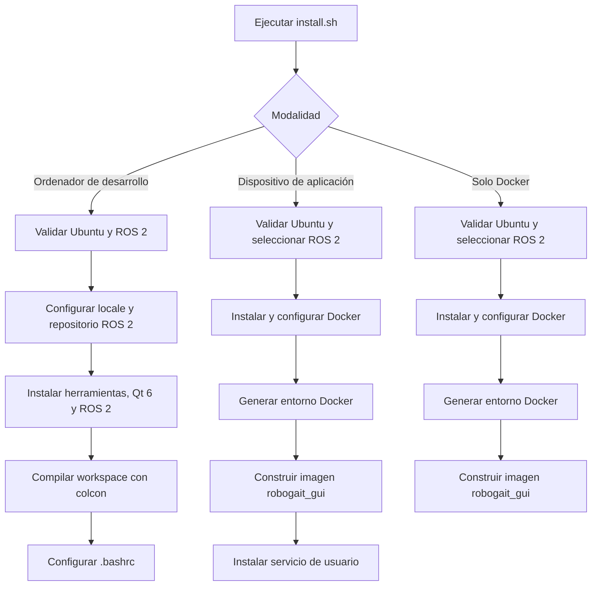

# Scripts de instalación

<!-- TABLA DE CONTENIDOS -->
<details open>
    <summary><h2>Tabla de contenidos</h2></summary>
    <ol>
        <li><a href="#descripción">Descripción</a></li>
        <li><a href="#organización-de-los-scripts">Organización de los scripts</a></li>
        <li><a href="#flujos-de-instalación">Flujos de instalación</a></li>
        <li><a href="#scripts">Scripts</a></li>
        <li><a href="#uso">Uso</a></li>
        <li><a href="#cambios-realizados-en-el-sistema">Cambios realizados en el sistema</a></li>
        <li><a href="#servicio-docker">Servicio Docker</a></li>
    </ol>
</details>

<!-- DESCRIPCIÓN -->
## Descripción

Este directorio contiene las funciones utilizadas por [`install.sh`](../install.sh) para preparar un ordenador de desarrollo o desplegar la aplicación ROBOGait mediante Docker.

Los scripts auxiliares se cargan con `source` desde el instalador principal. Comparten funciones y variables como `ROOT_DIR`, `ROS_DISTRO`, `DOCKER_DIR`, `apt_install` y `sudo_cmd`.

> [!WARNING]
>
>El instalador modifica la configuración del sistema: añade repositorios APT, instala paquetes, puede eliminar paquetes Docker incompatibles, añade el usuario al grupo `docker`, compila el workspace y, según la modalidad elegida, modifica `.bashrc` o instala un servicio de usuario de systemd.

<!-- ORGANIZACIÓN DE LOS SCRIPTS -->
## Organización de los scripts

* [`common.sh`](common.sh) &rarr; Funciones compartidas, validación del sistema, selección de distro de ROS 2 y ejecución de comandos con `sudo`.

* [`install_ros2.sh`](install_ros2.sh) &rarr; Configuración del repositorio oficial de ROS 2 e instalación de sus dependencias.

* [`install_qt6.sh`](install_qt6.sh) &rarr; Instalación de Qt 6, módulos QML, teclado virtual y controlador SQLite.

* [`install_dev_dependencies.sh`](install_dev_dependencies.sh) &rarr; Herramientas de compilación y desarrollo.

* [`build_workspace.sh`](build_workspace.sh) &rarr; Compilación del workspace y configuración del entorno de desarrollo.

* [`install_docker.sh`](install_docker.sh) &rarr; Instalación de Docker Engine, preparación del entorno y construcción de la imagen.

* [`install_docker_service.sh`](install_docker_service.sh) &rarr; Creación y activación del servicio que inicia la GUI en Docker.

<!-- FLUJOS DE INSTALACIÓN -->
## Flujos de instalación

[`install.sh`](../install.sh) es el punto de entrada y permite elegir una de estas modalidades:



<!-- SCRIPTS -->
## Scripts

### `common.sh`

Proporciona las funciones comunes del instalador:

* Registro de operaciones y gestión de errores.
* Solicitud y reutilización de la contraseña de `sudo` durante la ejecución.
* Validación de Ubuntu.
* Selección de ROS 2 Humble o Jazzy.
* Validación de la combinación entre Ubuntu y ROS 2.
* Instalación de paquetes APT y actualización idempotente de `.bashrc`.

### `install_dev_dependencies.sh`

Instala compiladores, CMake, herramientas de Python y `colcon`, dependencias de YAML y Boost, utilidades de red y herramientas de desarrollo. También instala `sqlite3` y `sqlitebrowser` para inspeccionar la base de datos durante el desarrollo.

Delega las dependencias específicas de Qt 6 y ROS 2 en sus respectivos scripts.

### `install_qt6.sh`

Instala las bibliotecas de desarrollo y ejecución de Qt 6 utilizadas por `robogait_gui`, incluidos Qt Quick, QML, Qt Virtual Keyboard, OpenGL, SVG y el controlador `libqt6sql6-sqlite`.

> [!NOTE]
>
>Este script instala Qt 6 desde los repositorios de Ubuntu, pero no instala el IDE Qt Creator.

### `install_ros2.sh`

Añade la clave y el repositorio oficial de ROS 2 para la versión de Ubuntu detectada. Después instala ROS Base y las dependencias ROS utilizadas por los paquetes del workspace.

### `build_workspace.sh`

Carga `/opt/ros/${ROS_DISTRO}/setup.bash` y compila estos paquetes:

* `command_executor_msgs`
* `navigation_pkg`
* `command_executor`
* `robogait_gui`

La compilación utiliza:

```bash
colcon build \
    --merge-install \
    --base-paths src \
    --packages-select command_executor_msgs navigation_pkg command_executor robogait_gui
```

Al finalizar, añade estas líneas a `.bashrc` si todavía no existen:

```bash
source /opt/ros/${ROS_DISTRO}/setup.bash
source <ruta-del-repositorio>/install/setup.bash
```

### `install_docker.sh`

Elimina paquetes que puedan entrar en conflicto con Docker CE, configura el repositorio oficial, instala Docker Engine y sus plugins, y añade el usuario actual al grupo `docker`.

También ejecuta [`docker/setup_docker_env.sh`](../docker/setup_docker_env.sh), que prepara el directorio persistente del usuario y la configuración de Docker, y construye la imagen definida en [`docker/DockerFile`](../docker/DockerFile).

### `install_docker_service.sh`

Genera el servicio de usuario:

```text
~/.config/systemd/user/robogait-gui-docker.service
```

También se crea un lanzador en `~/.local/bin` y una entrada XDG Autostart en `~/.config/autostart`. Cuando el usuario abre la sesión gráfica, el lanzador importa `DISPLAY`, `XAUTHORITY` y las variables de Wayland en el gestor systemd antes de iniciar el servicio. El servicio ejecuta Docker Compose desde el directorio `docker`, comparte la pantalla X11 y reinicia el contenedor si el proceso falla, con un límite de tres intentos por minuto.

La instalación añade además ROBOGait GUI al menú de aplicaciones mediante `~/.local/share/applications/robogait-gui.desktop`, instala su icono en `~/.local/share/icons` y, cuando se utiliza GNOME, conserva los favoritos existentes y añade el lanzador a la barra. Este acceso permite volver a iniciar la aplicación sin utilizar una terminal.

El script puede reinstalar únicamente este mecanismo sin repetir la instalación completa:

```bash
./scripts/install_docker_service.sh jazzy
```

Utilice `humble` en lugar de `jazzy` cuando corresponda. Si `docker/.env` ya contiene `ROS_DISTRO`, el argumento puede omitirse.

<!-- USO -->
## Uso

Ejecute siempre el instalador principal desde la raíz del repositorio:

```bash
chmod +x install.sh
./install.sh
```

> [!IMPORTANT]
>
>Salvo `install_docker_service.sh`, no ejecute directamente los archivos de `scripts/`. Están diseñados para cargarse desde `install.sh` y dependen del contexto inicializado por este.

Tras una instalación de desarrollo, abra una nueva terminal o cargue manualmente el entorno. Ejecute solo la opción correspondiente a su distribución:

```bash
# ROS 2 Humble en Ubuntu 22.04
source /opt/ros/humble/setup.bash
source install/setup.bash
```

o bien:

```bash
# ROS 2 Jazzy en Ubuntu 24.04
source /opt/ros/jazzy/setup.bash
source install/setup.bash
```

Tras instalar Docker, cierre la sesión y vuelva a entrar, o reinicie el equipo, para aplicar la pertenencia al grupo `docker`.

<!-- CAMBIOS REALIZADOS EN EL SISTEMA -->
## Cambios realizados en el sistema

|         Modalidad         |                                        Cambios principales                                        |
|---------------------------|---------------------------------------------------------------------------------------------------|
|         Desarrollo        |      Repositorio ROS 2, paquetes APT, locale, compilación del workspace y líneas en `.bashrc`     |
| Dispositivo de aplicación | Repositorio y paquetes Docker, grupo `docker`, archivo `.env`, imagen local y servicio de usuario |
|         Solo Docker       |            Repositorio y paquetes Docker, grupo `docker`, archivo `.env` e imagen local           |

Los scripts intentan evitar duplicados en `.bashrc` y reutilizan la configuración existente cuando es posible. La instalación de Docker puede eliminar previamente paquetes incompatibles como `docker.io`, `podman-docker`, `containerd` o `runc`.

<!-- SERVICIO DOCKER -->
## Servicio Docker

Después de cerrar y volver a abrir la sesión, la entrada XDG Autostart inicia automáticamente el servicio. También puede gestionarse mediante:

```bash
systemctl --user start robogait-gui-docker.service
systemctl --user stop robogait-gui-docker.service
systemctl --user restart robogait-gui-docker.service
systemctl --user status robogait-gui-docker.service
```

Para consultar sus registros:

```bash
journalctl --user -u robogait-gui-docker.service -f
```