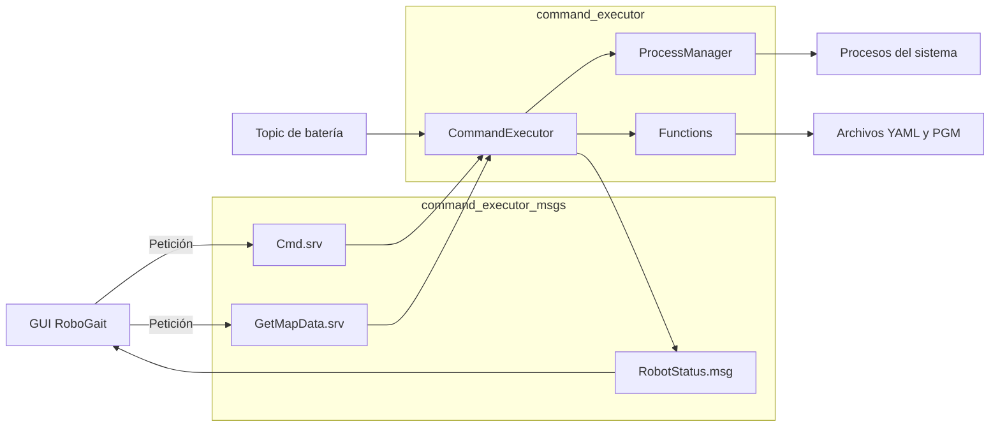
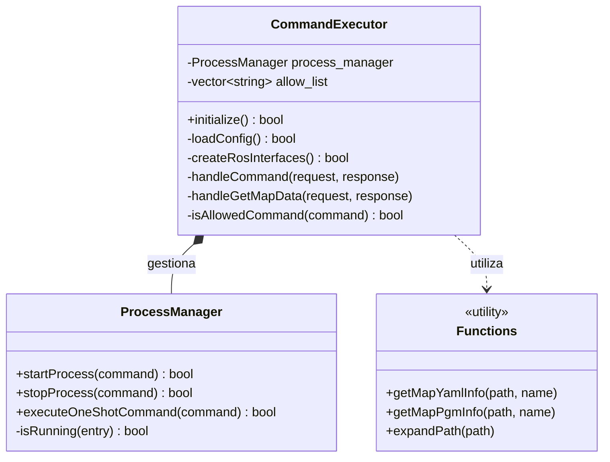
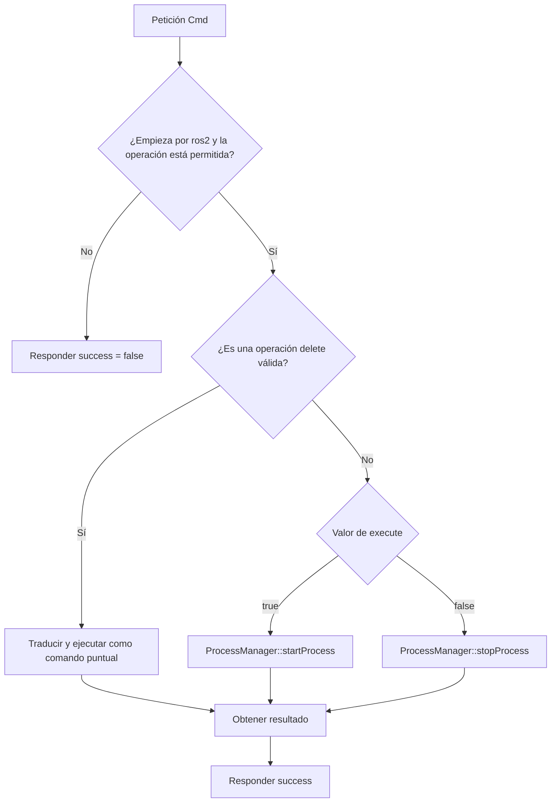

# Command Executor Node

<!-- TABLA DE CONTENIDOS -->
<details open>
    <summary><h2>Tabla de contenidos</h2></summary>
    <ol>
        <li><a href="#descripción">Descripción</a></li>
        <li><a href="#organización-del-proyecto">Organización del proyecto</a></li>
        <li><a href="#estructura-de-directorios">Estructura de directorios</a></li>
        <li><a href="#arquitectura-y-flujos">Arquitectura y flujos</a></li>
        <li><a href="#command-executor">Command Executor</a></li>
        <li><a href="#command-executor-msgs">Command Executor msgs</a></li>
        <li><a href="#dependencias">Dependencias</a></li>
        <li><a href="#compilación">Compilación</a></li>
        <li><a href="#tests">Tests</a></li>
        <li><a href="#configuración">Configuración</a></li>
        <li><a href="#ejecución-del-nodo">Ejecución del nodo</a></li>
    </ol>
</details>

<!-- DESCRIPCIÓN -->
## Descripción

Este componente permite ejecutar desde la GUI un conjunto controlado de comandos en el robot. Los comandos se validan mediante una lista de operaciones permitidas antes de iniciar o detener procesos como navegación y mapeo.

La comunicación entre la GUI y el robot se realiza mediante servicios, mensajes y topics de ROS 2.

<!-- ORGANIZACIÓN DEL PROYECTO -->
## Organización del proyecto

El proyecto está dividido en dos paquetes ROS 2:

* ***command_executor*** &rarr; Nodo principal que contiene la lógica de ejecución, gestión de procesos y las interfaces ROS.

* ***command_executor_msgs*** &rarr; Paquete que define los mensajes y servicios utilizados para la comunicación.

`command_executor` también crea la librería estática interna `command_executor_lib`. Esta contiene la implementación compartida por el ejecutable del nodo y los tests; no se instala como una librería pública del paquete.

<!-- ESTRUCTURA DE DIRECTORIOS -->
## Estructura de directorios

* [`command_executor/`](command_executor/) &rarr; Nodo y lógica de ejecución.

  * [`include/`](command_executor/include/) &rarr; Interfaces C++.
  * [`params/config.yaml`](command_executor/params/config.yaml) &rarr; Parámetros obligatorios del nodo.
  * [`src/`](command_executor/src/) &rarr; Implementación y punto de entrada.
  * [`test/`](command_executor/test/) &rarr; Tests unitarios y de integración ROS.
  * [`CMakeLists.txt`](command_executor/CMakeLists.txt) &rarr; Configuración de compilación.
  * [`package.xml`](command_executor/package.xml) &rarr; Manifiesto del paquete.

* [`command_executor_msgs/`](command_executor_msgs/) &rarr; Interfaces ROS.

  * [`msg/RobotStatus.msg`](command_executor_msgs/msg/RobotStatus.msg) &rarr; Estado del robot.
  * [`srv/Cmd.srv`](command_executor_msgs/srv/Cmd.srv) &rarr; Ejecución y detención de comandos.
  * [`srv/GetMapData.srv`](command_executor_msgs/srv/GetMapData.srv) &rarr; Lectura de mapas.
  * [`CMakeLists.txt`](command_executor_msgs/CMakeLists.txt) &rarr; Generación de interfaces ROS.
  * [`package.xml`](command_executor_msgs/package.xml) &rarr; Manifiesto del paquete.

<!-- ARQUITECTURA Y FLUJOS -->
## Arquitectura y flujos

### Arquitectura de comunicación



### Clases principales

El diagrama muestra las relaciones esenciales del paquete, omitiendo detalles internos de ROS para facilitar su lectura.



### Flujo del servicio de comandos



<!-- COMMAND EXECUTOR -->
## Command Executor

El paquete `command_executor` tiene las siguientes responsabilidades:

* Validar los comandos solicitados utilizando la lista `allow_list` de la configuración.

* Gestionar el ciclo de vida de los procesos activos, incluyendo su creación, registro, detención y eliminación mediante `ProcessManager`.

* Exponer los servicios ROS utilizados por la GUI mediante `CommandExecutor`.

* Publicar periódicamente el estado del robot como heartbeat.

* Recibir el nivel de batería del robot y añadirlo a `RobotStatus`.

>[!NOTE]
>
>Solo se permiten operaciones de la CLI de ROS 2 incluidas en `allow_list`. La operación especial `delete` se traduce internamente a la eliminación controlada de mapas, evitando aceptar comandos arbitrarios como `rm`.

<!-- COMMAND EXECUTOR MSGS -->
## Command Executor msgs

El paquete `command_executor_msgs` contiene las interfaces ROS compartidas con la GUI.

### Mensajes

[`RobotStatus.msg`](command_executor_msgs/msg/RobotStatus.msg) define el estado publicado periódicamente por el robot:

|      Campo      |    Tipo    |              Descripción            |
| --------------- | ---------- | ----------------------------------- |
|       `id`      |   `uint8`  |       Identificador del robot       |
|    `battery`    |  `float32` |           Nivel de batería          |
|       `ns`      |  `string`  | Namespace configurado para el robot |
|    `version`    |  `string`  |    Versión del software del robot   |
|  `hardware_id`  |  `uint32`  |      Identificador del hardware     |
| `serial_number` |  `string`  |            Número de serie          |

### Servicios

* `Cmd.srv` &rarr; Solicita el inicio o la detención de un comando permitido.

* `GetMapData.srv` &rarr; Obtiene el contenido YAML y PGM de un mapa guardado.

>[!WARNING]
>
>El directorio enviado en `GetMapData.map_path` debe existir en el robot y ser accesible por el proceso. El despliegue habitual utiliza `$HOME/maps/`, donde `map_saver_cli` genera los archivos del mapa.

<!-- DEPENDENCIAS -->
## Dependencias

Los paquetes necesitan un entorno ROS 2 instalado y correctamente cargado:

```bash
source /opt/ros/${ROS_DISTRO}/setup.bash
```

Dependencias principales de `command_executor`:

* `ament_cmake` | `ament_cmake_ros`
* `rclcpp`
* `sensor_msgs`
* `command_executor_msgs`
* Boost &rarr; `system` | `filesystem`

Dependencias principales de `command_executor_msgs`:

* `ament_cmake`
* `rosidl_default_generators`
* `rosidl_default_runtime`

En Ubuntu con ROS 2 pueden instalarse mediante:

```bash
sudo apt install \
    ros-${ROS_DISTRO}-ament-cmake \
    ros-${ROS_DISTRO}-ament-cmake-ros \
    ros-${ROS_DISTRO}-rclcpp \
    ros-${ROS_DISTRO}-sensor-msgs \
    ros-${ROS_DISTRO}-rosidl-default-generators \
    libboost-system-dev \
    libboost-filesystem-dev
```

Para compilar los tests también se necesita:

```bash
sudo apt install ros-${ROS_DISTRO}-ament-cmake-gtest
```

<!-- COMPILACIÓN -->
## Compilación

Desde la raíz del workspace:

```bash
colcon build --packages-up-to command_executor
source install/setup.bash
```

`--packages-up-to` compila todos los paquetes necesarios para `command_executor`, incluyendo `command_executor_msgs`.

Por defecto, los tests de `command_executor` están deshabilitados y no se compilan. Consulta la sección [Tests](#tests) para habilitarlos.

<!-- TESTS -->
## Tests

Los tests se dividen en dos niveles técnicos.

### Tests unitarios

Validan componentes concretos sin levantar el nodo completo:

* `test_functions.cpp`

  * Lectura correcta de los archivos YAML y PGM de un mapa.
  * Gestión de mapas inexistentes.
  * Expansión de rutas que contienen `~` o `$HOME`.
  * Conservación de rutas absolutas que no necesitan expansión.

* `test_process_manager.cpp`

  * Rechazo de la detención de procesos desconocidos.
  * Resultado de comandos de ejecución única.
  * Prevención de procesos duplicados.
  * Reinicio de un proceso después de detenerlo.
  * Acceso concurrente a procesos diferentes sin mantener bloqueado globalmente el gestor durante una detención lenta.

### Test de integración del paquete ROS

* `test_command_executor_ros.cpp`

  Se ejecuta mediante `ament_add_ros_isolated_gtest`, con un dominio ROS aislado. Comprueba:

  * Que la inicialización falla cuando faltan parámetros obligatorios.
  * Que el nodo se inicializa con un archivo de configuración válido.
  * Que el servicio `Cmd` rechaza comandos no incluidos en `allow_list`.
  * Que el heartbeat `RobotStatus` se publica con la información configurada del robot.

### Compilar y ejecutar los tests

Los tests están deshabilitados por defecto mediante:

```cmake
option(BUILD_TESTING "Build command_executor tests" OFF)
```

Para compilarlos explícitamente:

```bash
colcon build \
    --packages-up-to command_executor \
    --cmake-args -DBUILD_TESTING=ON
```

Para ejecutarlos y mostrar los resultados:

```bash
colcon test --packages-select command_executor
colcon test-result --verbose
```

Para volver a una compilación normal sin tests:

```bash
colcon build \
    --packages-up-to command_executor \
    --cmake-args -DBUILD_TESTING=OFF
```

>[!NOTE]
>
>CMake conserva el valor de `BUILD_TESTING` en la caché del paquete. Por eso es recomendable indicar explícitamente `ON` u `OFF` cuando se cambia de modalidad dentro del mismo workspace.

<!-- CONFIGURACIÓN -->
## Configuración

El nodo necesita el archivo `params/config.yaml`. Sus parámetros obligatorios son:

* `robot_info.id`
* `robot_info.namespace`
* `robot_info.version`
* `robot_info.hardware_id`
* `robot_info.serial_number`
* `allow_list`

Ejemplo:

```yaml
command_executor:
  ros__parameters:
    robot_info:
      id: 1
      namespace: "ROBOGait"
      version: "V3"
      hardware_id: 12345678
      serial_number: "ROBOGait-001"

    allow_list:
      - action
      - node
      - run
      - service
      - topic
      - launch
      - delete
```

<!-- EJECUCIÓN DEL NODO -->
## Ejecución del nodo

Después de compilar y cargar el workspace, puede obtenerse la ruta instalada de la configuración sin depender de una ruta absoluta:

```bash
CONFIG_FILE="$(ros2 pkg prefix command_executor)/share/command_executor/params/config.yaml"
```

### Sin namespace ROS

```bash
ros2 run command_executor command_executor_node \
    --ros-args \
    --params-file "$CONFIG_FILE"
```

### Con namespace ROS

```bash
ros2 run command_executor command_executor_node \
    --ros-args \
    --params-file "$CONFIG_FILE" \
    --remap __ns:=/namespace-deseado
```

El namespace de ROS aplicado al nodo y el parámetro `robot_info.namespace` tienen responsabilidades diferentes: el primero determina dónde se crean las interfaces ROS y el segundo identifica al robot dentro del mensaje `RobotStatus`.
