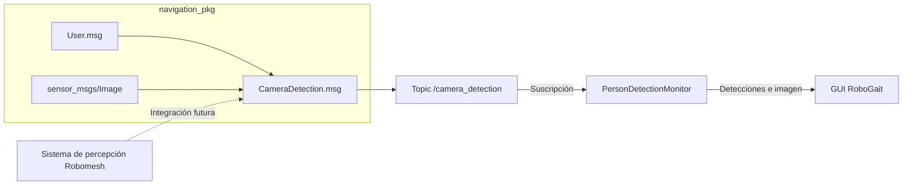

# Navigation pkg

<!-- TABLA DE CONTENIDOS -->
<details open>
    <summary><h2>Tabla de contenidos</h2></summary>
    <ol>
        <li><a href="#descripción">Descripción</a></li>
        <li><a href="#estructura-del-paquete">Estructura del paquete</a></li>
        <li><a href="#arquitectura-y-flujo">Arquitectura y flujo</a></li>
        <li><a href="#interfaces-ros-2">Interfaces ROS 2</a></li>
        <li><a href="#dependencias">Dependencias</a></li>
        <li><a href="#compilación">Compilación</a></li>
        <li><a href="#validación-de-las-interfaces">Validación de las interfaces</a></li>
        <li><a href="#prueba-temporal-con-la-gui">Prueba temporal con la GUI</a></li>
    </ol>
</details>

<!-- DESCRIPCIÓN -->
## Descripción

`navigation_pkg` es una copia local de un paquete de interfaces ROS 2 de RoboMesh, incorporada al workspace para mantener la compatibilidad de mensajes entre el software que se ejecuta en el robot y la GUI de RoboGait.

`User.msg` conserva la interfaz procedente de RoboMesh.

`CameraDetection.msg` es una extensión desarrollada específicamente para RoboGait_GUI que añade una captura de cámara a la detección. La GUI ya dispone del consumidor `PersonDetectionMonitor`, mientras que la publicación de este mensaje desde el robot se integrará cuando se desarrolle esa funcionalidad.

<!-- ESTRUCTURA DEL PAQUETE -->
## Estructura del paquete

* [`msg/`](msg/) &rarr; Definiciones de mensajes ROS 2.

  * [`User.msg`](msg/User.msg) &rarr; Interfaz de RoboMesh replicada por compatibilidad.
  * [`CameraDetection.msg`](msg/CameraDetection.msg) &rarr; Extensión de GUI_RoboGait que acompaña la detección con una imagen.

* [`CMakeLists.txt`](CMakeLists.txt) &rarr; Configuración de generación de interfaces.
* [`package.xml`](package.xml) &rarr; Metadatos y dependencias del paquete.
* [`publish_camera_detection.py`](publish_camera_detection.py) &rarr; Publicador temporal para probar la integración con la GUI.
* [`README.md`](README.md) &rarr; Documentación del paquete.

<!-- ARQUITECTURA Y FLUJO -->
## Arquitectura y flujo

### Flujo objetivo de comunicación con la GUI



## Interfaces ROS 2

### User.msg

[`User.msg`](msg/User.msg) procede del paquete de RoboMesh y se mantiene sin cambios para que ambos entornos utilicen el mismo tipo ROS 2. Representa el resultado de la detección de personas y sus coordenadas asociadas.

| Campo | Tipo ROS 2 | Descripción |
| --- | --- | --- |
| `detection` | `int32` | Número de detecciones de personas. Un valor mayor que cero indica una detección válida para la GUI. |
| `x` | `float64` | Posición asociada en el eje X. |
| `y` | `float64` | Posición asociada en el eje Y. |
| `z` | `float64` | Posición asociada en el eje Z. |

>[!NOTE]
>
>`User.msg` se ha heredado de la implementación actual de RoboMesh y no incluye `Header` ni identifica el sistema de coordenadas. Para mantener la compatibilidad, se conserva esta definición; el publicador y los consumidores deben compartir el criterio utilizado para el frame y las unidades de `x`, `y` y `z`.

### CameraDetection.msg

[`CameraDetection.msg`](msg/CameraDetection.msg) es una extensión propia de GUI_RoboGait. Agrupa el mensaje compatible `User` y la captura que deberá publicar el robot cuando se complete la integración.

| Campo | Tipo ROS 2 | Descripción |
| --- | --- | --- |
| `user_detection` | `navigation_pkg/User` | Información de la detección de personas. |
| `snapshot` | `sensor_msgs/Image` | Imagen capturada en el momento de la detección. |

<!-- DEPENDENCIAS -->
## Dependencias

El paquete necesita un entorno ROS 2 instalado y correctamente cargado:

```bash
source /opt/ros/${ROS_DISTRO}/setup.bash
```

Dependencias de compilación y ejecución:

* `ament_cmake`
* `rosidl_default_generators`
* `rosidl_default_runtime`
* `sensor_msgs`

En Ubuntu con ROS 2 pueden instalarse mediante:

```bash
sudo apt install \
    ros-${ROS_DISTRO}-ament-cmake \
    ros-${ROS_DISTRO}-rosidl-default-generators \
    ros-${ROS_DISTRO}-sensor-msgs
```

<!-- COMPILACIÓN -->
## Compilación

Desde la raíz del workspace:

```bash
colcon build --packages-select navigation_pkg
source install/setup.bash
```

La compilación genera las representaciones de `User` y `CameraDetection` necesarias para C++, Python y los mecanismos de introspección disponibles en la instalación de ROS 2.

<!-- VALIDACIÓN DE LAS INTERFACES -->
## Validación de las interfaces

Después de compilar y cargar el workspace, las definiciones generadas pueden inspeccionarse con:

```bash
ros2 interface show navigation_pkg/msg/User
ros2 interface show navigation_pkg/msg/CameraDetection
```

También puede verificarse que el paquete está disponible:

```bash
ros2 pkg prefix navigation_pkg
```

<!-- PRUEBA TEMPORAL CON LA GUI -->
## Prueba temporal con la GUI

Mientras el robot no publique todavía `CameraDetection`, el script [`publish_camera_detection.py`](publish_camera_detection.py) permite generar el mensaje manualmente para probar `PersonDetectionMonitor` y el flujo correspondiente de la GUI.

Es una utilidad de desarrollo y no se instala como ejecutable ROS mediante CMake. Debe lanzarse directamente con Python desde el repositorio.

### Requisitos

El paquete debe estar compilado y el workspace cargado para que Python pueda importar el mensaje generado:

```bash
colcon build --packages-select navigation_pkg
source install/setup.bash
```

El script utiliza Pillow para cargar y redimensionar imágenes:

```bash
sudo apt install python3-pil
```

El publicador y la GUI deben utilizar el mismo `ROS_DOMAIN_ID`:

```bash
export ROS_DOMAIN_ID=0
```

Sustituye `0` por el dominio configurado en la GUI cuando sea diferente.

### Ejecución interactiva

Desde la raíz del repositorio y sin namespace de robot:

```bash
python3 src/navigation_pkg/publish_camera_detection.py \
    --topic /camera_detection
```

Si la GUI está conectada a un robot mediante namespace, el topic debe incluirlo. Por ejemplo, para `/ROBOGait`:

```bash
python3 src/navigation_pkg/publish_camera_detection.py \
    --topic /ROBOGait/camera_detection
```

El script muestra las imágenes disponibles y solo acepta su número:

```text
Imagenes disponibles:
  1. car.png
  2. etsidi.png
  3. ministerio.png

Elige una imagen por numero [Ctrl+C para salir]: 1
```

Puede cerrarse de forma limpia mediante `Ctrl+C`. Una entrada vacía o cualquier texto que no sea un número válido volverá a mostrar el prompt.

### Publicación directa

Para publicar una imagen sin abrir el menú interactivo:

```bash
python3 src/navigation_pkg/publish_camera_detection.py \
    --topic /camera_detection \
    --image robogait.png \
    --detection 1 \
    --count 10
```

En este modo, `--image` acepta el nombre, una coincidencia parcial o la ruta absoluta de la imagen.

### Argumentos

| Argumento | Valor predeterminado | Descripción |
| --- | --- | --- |
| `-i`, `--image` | Menú interactivo | Imagen que se publicará sin mostrar el menú. |
| `-t`, `--topic` | `/camera_detection` | Topic donde se publica `CameraDetection`. |
| `-d`, `--detection` | `1` | Valor del campo `user_detection.detection`. |
| `-n`, `--count` | `10` | Número de veces que se publica el mensaje. |
| `--max-size` | `800` | Tamaño máximo del lado mayor; `0` conserva el tamaño original. |
| `--logos-dir` | `src/robogait_gui/resources/Logos` del repositorio actual | Permite sobrescribir el directorio utilizado para buscar imágenes. |

>[!NOTE]
>
>Para que la GUI procese el mensaje, debe estar monitorizando `/camera_detection` — o su equivalente con namespace — y `detection` debe ser mayor que cero.
