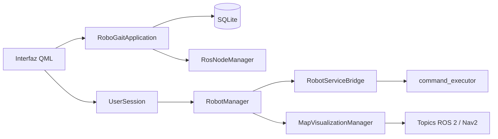
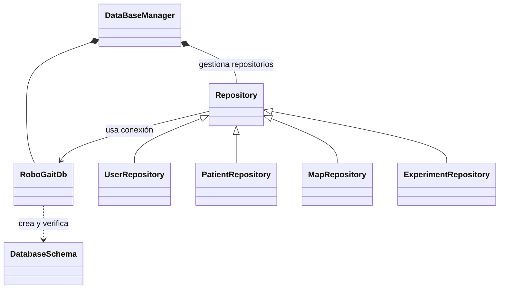
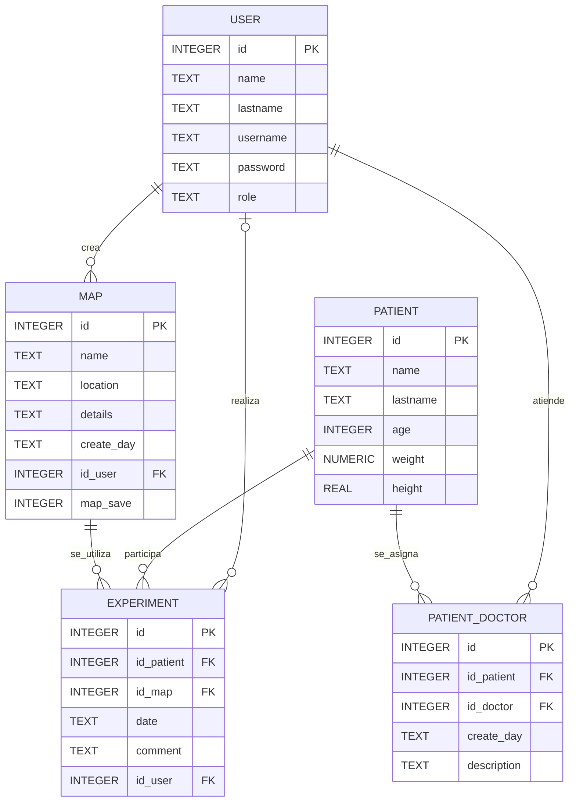
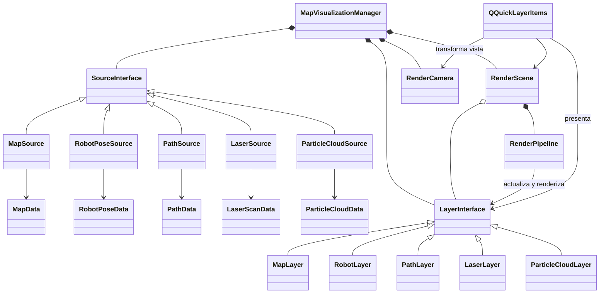
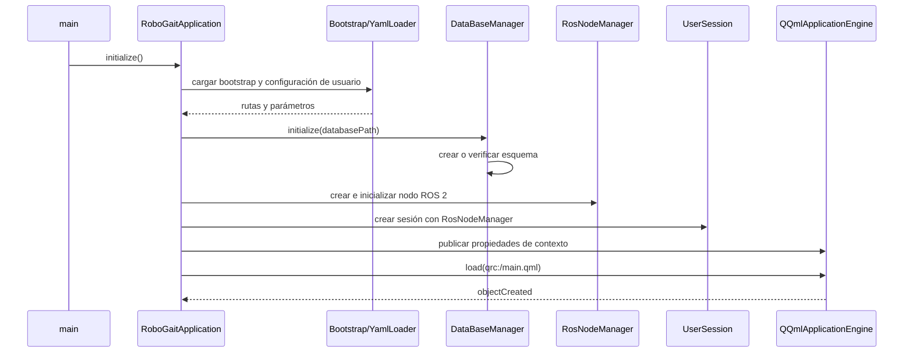
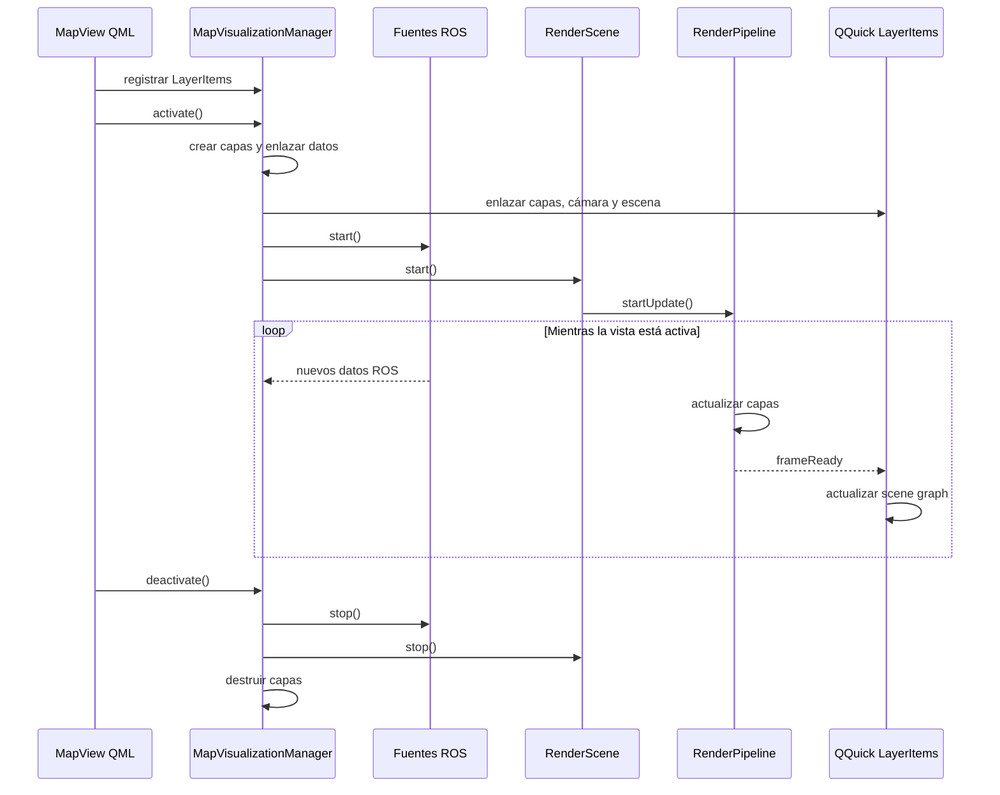

# robogait_gui

<!-- TABLA DE CONTENIDOS -->
<details open>
    <summary><h2>Tabla de contenidos</h2></summary>
    <ol>
        <li><a href="#descripción">Descripción</a></li>
        <li><a href="#estructura-de-directorios">Estructura de directorios</a></li>
        <li><a href="#arquitectura-y-flujos">Arquitectura y flujos</a></li>
        <li><a href="#componentes-principales">Componentes principales</a></li>
        <li><a href="#dependencias">Dependencias</a></li>
        <li><a href="#compilación">Compilación</a></li>
        <li><a href="#tests">Tests</a></li>
        <li><a href="#configuración">Configuración</a></li>
        <li><a href="#ejecución-de-la-aplicación">Ejecución de la aplicación</a></li>
    </ol>
</details>

<!-- DESCRIPCIÓN -->
## Descripción

GUI del proyecto ROBOGait desarrollada con Qt 6, Qt Quick y ROS 2. Las funcionalidades principales de la GUI son:

* Gestión de usuarios y pacientes.

* Descubrimiento, conexión, supervisión y control del robot.

* Visualización de mapas y trayectorias de navegación.

* Creación y almacenamiento de nuevos mapas.

* Realización y consulta de experimentos asociados a cada paciente.

<!-- ESTRUCTURA DE DIRECTORIOS -->
## Estructura de directorios

* [`include/`](include/) &rarr; Interfaces C++ organizadas por dominio.

* [`src/`](src/) &rarr; Implementación del backend C++ y punto de entrada.

* [`qml/`](qml/) &rarr; Interfaz Qt Quick, vistas, controles y diálogos.

* [`params/`](params/) &rarr; Configuración predeterminada, comandos y parámetros de navegación.

* [`resources/`](resources/) &rarr; Iconos, logotipos y recursos gráficos.

* [`test/`](test/) &rarr; Pruebas unitarias del paquete.

* [`qml.qrc`](qml.qrc) &rarr; Índice de vistas y componentes QML compilados como recursos Qt.

* [`qmlresources.qrc`](qmlresources.qrc) &rarr; Índice de imágenes y recursos gráficos utilizados desde QML.

* [`CMakeLists.txt`](CMakeLists.txt) &rarr; Configuración de compilación e instalación.

* [`package.xml`](package.xml) &rarr; Metadatos y dependencias ROS 2.

<!-- ARQUITECTURA Y FLUJOS -->
## Arquitectura y flujos

### Vista global



### Base de datos

El gestor mantiene una única conexión y delega las consultas de cada dominio en repositorios especializados.



El esquema persistente relaciona usuarios, pacientes, mapas y experimentos de la siguiente forma:



> [!NOTE]
>
>`PK` (*Primary Key* o clave primaria) identifica de forma única cada registro de una tabla. `FK` (*Foreign Key* o clave foránea) almacena la clave primaria de otra tabla para establecer una relación entre ambas. Por ejemplo, `EXPERIMENT.id_patient` es una `FK` que referencia a `PATIENT.id`, su `PK`.

### Visualización de mapas

El sistema separa la recepción de información ROS, sus datos compartidos, la preparación de cada capa y su presentación mediante elementos de Qt Quick.



### Flujos principales

Durante el arranque se prepara primero la configuración y los servicios C++; después se publica el contexto para cargar la interfaz QML.



La visualización consume recursos solo mientras una vista de mapa está activa:



<!-- COMPONENTES PRINCIPALES -->
## Componentes principales

|         Módulo        |                   Responsabilidad                  |
|-----------------------|----------------------------------------------------|
|   `Core` y `Context`  |   Arranque de la aplicación y contexto compartido  |
|       `DataBase`      |     Esquema SQLite, repositorios y persistencia    |
|         `User`        |     Autenticación, sesión, usuarios y pacientes    |
|        `Robot`        |     Descubrimiento, estado y control del robot     |
|         `Map`         | Datos, capas y renderizado de mapas y trayectorias |
|   `Ros` y `Services`  | Nodos, suscripciones y clientes de servicios ROS 2 |
| `Settings` y `Themes` |       Preferencias, traducciones y apariencia      |

<!-- DEPENDENCIAS -->
## Dependencias

Las dependencias se declaran en [`package.xml`](package.xml) y [`CMakeLists.txt`](CMakeLists.txt). El [instalador principal](../../install.sh) las instala automáticamente.

- **Qt 6**: Core, GUI, QML, Quick, Network, SQL y Widgets.
- **ROS 2**: `rclcpp`, mensajes estándar, TF2, Nav2 y Map Server.
- **Paquetes del proyecto**: `command_executor_msgs` y `navigation_pkg`.
- **Otras bibliotecas**: `yaml-cpp`.

### SQLite

La aplicación accede a SQLite mediante el controlador `QSQLITE` de Qt. La dependencia necesaria es `libqt6sql6-sqlite`, ya incluida en `install.sh` y en la imagen Docker.

Por defecto, la base de datos se crea en:

```text
~/.local/robogait/db_robogait.db
```

<!-- COMPILACIÓN -->
## Compilación

Desde la raíz del repositorio y con el entorno ROS cargado:

```bash
colcon build --packages-up-to robogait_gui
source install/setup.bash
```

### Opciones de CMake

|            Opción           | Valor predeterminado |                  Descripción                 |
|-----------------------------|:--------------------:|----------------------------------------------|
|       `BUILD_TESTING`       |         `OFF`        |        Compila las pruebas del paquete       |
| `ENABLE_WARNINGS_AS_ERRORS` |         `OFF`        | Trata los avisos del compilador como errores |
|     `SHOW_VERBOSE_LOGS`     |         `OFF`        |  Conserva la salida de depuración detallada  |

Por ejemplo, para habilitar los tests:

```bash
colcon build --packages-up-to robogait_gui --cmake-args -DBUILD_TESTING=ON
```

<!-- TESTS -->
## Tests

Los tests son unitarios y están agrupados por componente técnico.

### Carga de configuración

* `test_yaml_loader.cpp` &rarr; Carga, consulta y validación de la configuración YAML.

* `test_bootstrap_loader.cpp` &rarr; Resolución de las rutas de configuración persistente utilizadas durante el arranque.

### Datos, geometría y renderizado del mapa

* `test_map_data.cpp` | `test_path_data.cpp` | `test_robot_pose_data.cpp` | `test_sensor_data.cpp` &rarr; Modelos compartidos de mapas, trayectorias, poses, láser y nube de partículas.

* `test_stroke_processor.cpp` | `test_spline_geometry.cpp` &rarr; Procesamiento y suavizado geométrico de rutas dibujadas.

* `test_render_camera.cpp` &rarr; Zoom, encuadre y transformaciones de la cámara del mapa.

### Base de datos

* `test_db_common.cpp` &rarr; Resultados, errores y conversiones comunes utilizadas por la capa de persistencia.

* `test_database_schema.cpp` &rarr; Creación y validación del esquema *SQLite*.

* `test_repositories.cpp` &rarr; Operaciones de usuarios, pacientes, mapas y experimentos.

* `test_database_manager.cpp` &rarr; Inicialización y comportamiento coordinado del gestor de base de datos.

### Contexto del robot

* `test_robot_context.cpp` &rarr; Normalización de namespaces y construcción de topics y frames ROS.

### Compilar y ejecutar los tests

Los tests están deshabilitados por defecto en [`CMakeLists.txt`](CMakeLists.txt) mediante:

```cmake
option(BUILD_TESTING "Build robogait_gui tests" OFF)
```

Para compilarlos explícitamente:

```bash
colcon build \
    --packages-up-to robogait_gui \
    --cmake-args -DBUILD_TESTING=ON
```

Para ejecutarlos y mostrar los resultados:

```bash
colcon test --packages-select robogait_gui
colcon test-result --verbose
```

Para volver a una compilación normal sin tests:

```bash
colcon build \
    --packages-up-to robogait_gui \
    --cmake-args -DBUILD_TESTING=OFF
```

> [!WARNING]
>
>CMake conserva el valor de `BUILD_TESTING` en la caché del paquete. Es recomendable indicar explícitamente `ON` u `OFF` al cambiar de modalidad dentro del mismo workspace.

<!-- CONFIGURACIÓN -->
## Configuración

|                    Archivo                    |                                Finalidad                                |
|-----------------------------------------------|-------------------------------------------------------------------------|
|   [`bootstrap.yaml`](params/bootstrap.yaml)   |     Define la ubicación de la configuración persistente del usuario     |
|      [`config.yaml`](params/config.yaml)      | Configura interfaz, base de datos, ROS, robot, navegación y renderizado |
|    [`commands.yaml`](params/commands.yaml)    |           Define los comandos remotos de mapeado y navegación           |
| [`nav2_params.yaml`](params/nav2_params.yaml) |        Configuración de Nav2 de referencia para simular TurtleBot3      |

Durante el arranque, la aplicación lee `bootstrap.yaml` desde el directorio `share` del paquete. Si todavía no existen, copia `config.yaml` y `commands.yaml` desde ese mismo directorio a:

```text
~/.local/robogait/params
```

> [!NOTE]
>
>El archivo `nav2_params.yaml` incluido en el repositorio no se instala ni se copia a la configuración del usuario; contiene la configuración de referencia utilizada para simular TurtleBot3. El mecanismo de selección del archivo Nav2 se utiliza tanto en simulación como con el robot real. Su ubicación y nombre se definen en [`config.yaml`](params/config.yaml) mediante `navigation.nav2_params_path` y `navigation.nav2_params_file`.
>
>Estos valores se incorporan al comando que `command_executor` ejecuta en el robot. Por ello, para utilizar el robot real deben apuntar al directorio y al archivo de parámetros Nav2 existentes en su propio sistema de archivos.

<!-- EJECUCIÓN DE LA APLICACIÓN -->
## Ejecución de la aplicación

Con el workspace compilado y cargado:

```bash
source install/setup.bash
ros2 run robogait_gui robogait_gui
```
